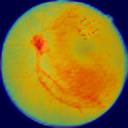
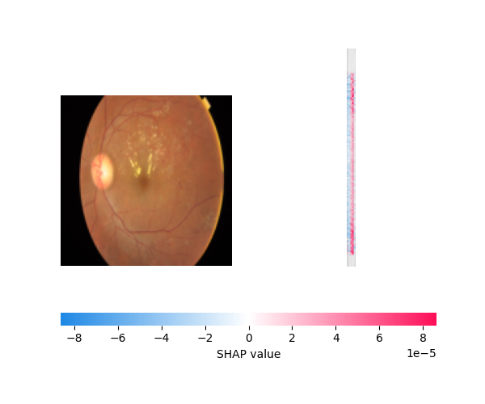

# Diabetic Retinopathy Classifier
A deep learning web app for diagnosing diabetic retinopathy from retinal fundus images, built with a custom CNN architecture and enhanced with visual interpretability tools.

[](https://www.python.org/)
[](LICENSE)

## Overview
This project uses a convolutional neural network (CNN) trained on the APTOS 2019 dataset to classify retinal images into diabetic retinopathy stages. The app provides both predictions and visual explanations using Grad-CAM and SHAP, helping clinicians and researchers explore model behavior and decision patterns.


## Intended Use

This project is intended as a **research and decision-support prototype** demonstrating the application of deep learning techniques to retinal fundus images for diabetic retinopathy classification.

The system is designed for **educational purposes, technical evaluation, and exploratory analysis** only. It is not intended to be used as a standalone diagnostic tool or to replace professional clinical assessment.

Any real-world clinical deployment would require **external validation, regulatory review, and prospective clinical evaluation**.

## Potential Clinical & Operational Applications

This model is designed as a **population-level screening and decision-support prototype**, not as a standalone diagnostic system.

Potential applications include:

- **Diabetic retinopathy screening support:**
Assisting large-scale screening programs by flagging retinal images with a higher likelihood of diabetic retinopathy for prioritized review by ophthalmologists.

- **Triage and workflow optimization:**
Supporting clinicians and screening centers by stratifying images into lower- and higher-risk categories, helping allocate specialist time more efficiently.

- **Clinical decision-support prototyping:**  
Demonstrating how deep learning predictions combined with visual explanations (Grad-CAM, SHAP) can enhance clinician understanding of image-based risk signals.

- **Quality assurance and model transparency:**
Using interpretability outputs to audit model behavior, identify failure modes, and support responsible AI development in medical imaging.

- **Medical AI education and training:**
Serving as a teaching and demonstration tool for clinicians, medical trainees, and data scientists learning about interpretable deep learning in ophthalmology.

- **Health-tech product development:** 
Acting as a proof-of-concept for startups or research teams developing early-stage AI-assisted retinal screening tools.

These applications assume **retrospective analysis and population-level screening contexts** and are **not intended for real-time clinical diagnosis or treatment decisions without prospective validation and regulatory approval**.

## Features
- Custom CNN architecture trained on real-world medical data  
- Grad-CAM overlays to highlight regions influencing predictions  
- SHAP visualizations for pixel-level feature attribution  
- Streamlit interface for easy image upload and exploration  
- Downloadable Grad-CAM and SHAP images  
- Side-by-side comparison toggle for interpretability  

## Project structure
```
diabetic-retinopathy-classifier/
│
├── README.md                      # Project overview, setup, and usage
├── LICENSE                        # Open-source license
├── requirements.txt               # Python dependencies
│
├── data/                          # Dataset placeholders (not included)
│   └── README.md                  # Dataset source and download instructions
│
├── src/                           # Source code
│   ├── app.py                     # Streamlit web application
│   ├── train.py                   # Model training script
│   ├── evaluate.py                # Model evaluation and metrics
│   ├── models.py                  # CNN architecture definitions
│   ├── data_utils.py              # Data loading and preprocessing
│   ├── diabetic_retinopathy.py    # Core classification logic
│   ├── explain.py                 # Explainability (Grad-CAM, SHAP)
│   ├── loss_curve.py              # Training loss visualization
│   ├── roc_auc_plot.py            # ROC-AUC curve plotting
│   ├── confusion_matrix_plot.py   # Confusion matrix visualization
│   └── dr_pipeline_demo.ipynb     # End-to-end notebook demo (optional)
│
├── visuals/                       # Selected visual results
│   ├── class_distribution.png     # Dataset class balance
│   ├── confusion_matrix.png       # Final confusion matrix
│   ├── loss_curve.png             # Training loss curve
│   ├── roc_auc_curve.png          # ROC-AUC curve
│   ├── gradcam_sample.png         # Representative Grad-CAM example
│   └── shap_sample.png            # Representative SHAP explanation
│
└── report/
    └── Diabetic_Retinopathy_AI_Decision_Support_Report.pdf

                                  # Final project report (PDF)
```


## Installation & Setup

### 1. Clone the repository
```bash
git clone https://github.com/global-ad-snap/diabetic-retinopathy-classifier.git
cd diabetic-retinopathy-classifier
```

### 2. Create a virtual environment
```
python -m venv venv
source venv/bin/activate  # or venv\Scripts\activate on Windows
```

### 3. Install dependencies
```
pip install -r requirements.txt
```

### 4. Launch the Streamlit app
```
streamlit run src/app.py
```

> Note: Trained model weights are not included in this repository.
> The model can be reproduced using `train.py`.

## Usage (Local Demo)

1. Activate the virtual environment:
   ```bash
   venv\Scripts\activate      # Windows
   source venv/bin/activate   # macOS/Linux
   ```
2. Install dependencies:
   ```bash
   pip install -r requirements.txt
   ```
3. Run the Streamlit application:
   ```bash
   streamlit run src/app.py
   ```
4. Open the app in your browser:
   ```bash
   http://localhost:8501
   ```
5. Upload a retinal image (PNG, JPG, JPEG) to:

     - View predicted diabetic retinopathy class
     - Visualize Grad-CAM heatmaps
     - Inspect SHAP pixel attributions
     - Downloadable visualizations

## Results & Screenshots

The following visualizations illustrate how the model interprets retinal images to make predictions:

| **Grad-CAM Overlay** | **SHAP Explanation** |
|----------------------|----------------------|
|  |  |

These visual explanations suggest that the model attends to retinal regions commonly associated with diabetic retinopathy, rather than background artifacts.

**Grad-CAM Overlay**  
Highlights the spatial regions most influential in the model’s decision, using class-specific activation maps.

**SHAP Explanation**  
Reveals pixel-level contributions to the prediction, offering a granular view of feature importance.

These interpretability tools provide complementary insights:

- **Grad-CAM** shows *where* the model is looking.  
- **SHAP** explains *why* the model made its decision.

Together, they enhance transparency and trust in the diagnostic process.

Interpretability methods are applied post-hoc and reflect model behavior on the provided examples rather than causal clinical reasoning.

Interpretability outputs should be interpreted as tools for model transparency and error analysis rather than explanations of underlying disease pathology.

## Tech Stack

- **Framework**: Streamlit  
- **Model**: Custom lightweight CNN (PyTorch), trained from scratch on APTOS 2019 
- **Visualization**: Grad-CAM (TorchCAM), SHAP  
- **Data**: APTOS 2019 Blindness Detection Dataset  
- **Tools**: PIL, matplotlib, numpy, torchvision  


## Model Info

- **Architecture**: Custom CNN  
- **Input Size**: 128×128  
- **Classes**: No DR, Mild, Moderate, Severe, Proliferative DR  
- **Training Dataset**: APTOS 2019  

### Environment
- Python 3.9 or 3.10 recommended
- PyTorch (CPU or CUDA)

## Consulting Use Case

This project demonstrates capabilities relevant to:

- Medical imaging AI prototyping
- Deep learning model development for healthcare data
- Model interpretability using Grad-CAM and SHAP
- Interactive decision-support demos using Streamlit
- Technical documentation and reporting for healthcare AI projects

In a consulting context, this work would be delivered as a **prototype decision-support system**, accompanied by documentation outlining model performance, limitations, and ethical considerations.

## Client-Ready Deliverables 
In a real-world consulting engagement, this project would be delivered as:
- Cleaned and documented dataset
- Trained and validated ML model
- Model performance report with clinical interpretation
- Explainability artifacts (SHAP / Grad-CAM where applicable)
- Interactive demo or dashboard (Streamlit)
- Model card and risk & limitation documentation

## License

This project is licensed under the **MIT License**.  
See the [LICENSE](LICENSE) file for details.


## Disclaimer

This project does **not constitute medical advice, diagnosis, or treatment recommendations**. The model was trained and evaluated on a retrospective dataset (APTOS 2019) and may not generalize to different populations, imaging devices, or clinical settings.

Model predictions are probabilistic and subject to limitations related to data quality, sampling bias, and model assumptions. The interpretability outputs (Grad-CAM and SHAP) reflect post-hoc model behavior and should not be interpreted as causal clinical reasoning.

This project is **not a certified medical device** and must not be used for clinical decision-making.

## Author

**Medical AI & Healthcare Data Science Consultant**

Physician (MBBS) with a Master’s (Global Communication) and professional training in Machine Learning, Deep Learning, Natural Language Processing, and AI for Medicine. I help healthcare startups, researchers, and digital health teams apply machine learning to build clinical risk models, analyze medical data, and prototype AI-driven decision-support systems, translating real-world healthcare data into actionable insights.